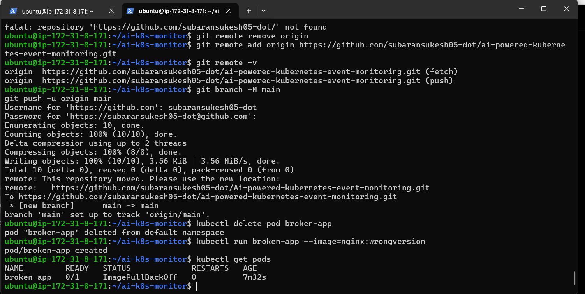

# AI-Powered Kubernetes Event Monitoring System

An AI-driven Kubernetes event monitoring system that watches cluster events in real time and explains failures using a local LLM.

This project captures Kubernetes events (such as `ImagePullBackOff`, `ErrImagePull`, `BackOff`, and deployment failures), sends them to an AI model for analysis, and provides human-readable root cause explanations with suggested fixes.

## Features

* Real-time Kubernetes event monitoring
* AI-powered failure analysis using a local LLM
* Event-driven observability (not metrics-driven)
* Human-readable root cause explanations
* Lightweight architecture using local inference
* Kubernetes + DevOps + AI integration

## Architecture

## Architecture

```text
Kubernetes Cluster (Minikube)
            ↓
Real-Time Event Watcher (Python)
            ↓
Kubernetes Event Filtering
            ↓
Ollama + Gemma 2B (LLM)
            ↓
AI Root Cause Analysis
            ↓
Human-readable Explanation
```

The system continuously watches Kubernetes cluster events using the Kubernetes Python SDK. Important failure events are sent to a local LLM through Ollama for analysis and remediation suggestions.

## Tech Stack

* Kubernetes
* Minikube
* Docker
* Python
* Ollama
* Gemma 2B
* LangGraph
* Streamlit

## Project Structure

```text
ai-k8s-monitor/
│
├── k8s-agent/
│   ├── watcher.py
│   ├── ai_agent.py
│   └── prompt_engine.py
│
├── manifests/
├── ui/
│   └── app.py
│
├── requirements.txt
└── README.md
```

## How It Works

The system continuously watches Kubernetes cluster events using the Kubernetes Python SDK.

When a failure event occurs:

* `ErrImagePull`
* `ImagePullBackOff`
* `BackOff`
* `Failed`
* `CrashLoopBackOff`
* `OOMKilled`

The event is sent to a local AI model running through Ollama.

The AI explains:

1. What happened
2. Why it happened
3. Severity level
4. Suggested remediation

## Example Failure Detection
## Demo Screenshots

### Watcher Running


### Kubernetes Failure Detection (`ImagePullBackOff`)



### AI Root Cause Analysis


Example Kubernetes failure:

```bash
kubectl run broken-app --image=nginx:wrongversion
```

Detected Event:

```text
ImagePullBackOff
ErrImagePull
Failed to pull image
```

AI Explanation Example:

```text
What happened:
Kubernetes failed to pull the container image.

Why it happened:
The image tag does not exist.

Severity:
High

Suggested Fix:
Use a valid image tag or verify the image name.
```

## Installation

Clone the repository:

```bash
git clone <repo-url>
cd ai-k8s-monitor
```

Create virtual environment:

```bash
python3 -m venv venv
source venv/bin/activate
```

Install dependencies:

```bash
pip install -r requirements.txt
```

Install Ollama:

```bash
curl -fsSL https://ollama.com/install.sh | sh
```

Pull model:

```bash
ollama pull gemma:2b
```

Start Kubernetes cluster:

```bash
minikube start --driver=docker
```

Run the watcher:

```bash
cd k8s-agent
python3 watcher.py
```

## Current Status

MVP completed:

* Real-time Kubernetes event monitoring
* AI-powered Kubernetes event explanation
* Failure detection (`ImagePullBackOff`, `ErrImagePull`, `Failed`)
* Local LLM inference using Ollama

## Future Enhancements

* Pod log analysis
* Streamlit dashboard UI
* Slack alerts
* Multi-agent remediation workflow
* Auto-remediation suggestions
* Grafana integration

## Resume Value

This project demonstrates:

* Kubernetes
* DevOps automation
* AI for DevOps
* Event-driven observability
* Root cause analysis
* Local LLM integration
* Python automation
